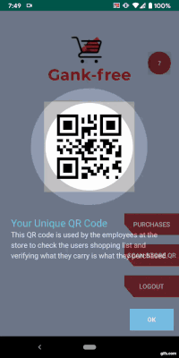
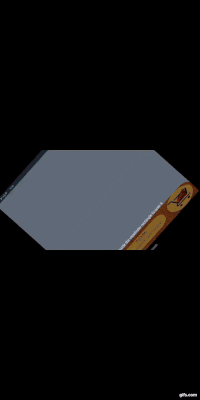
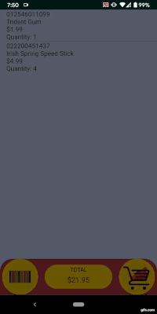
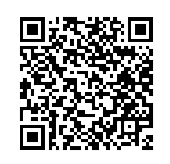
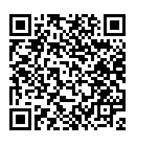

# Grab and Go Store
Everyone walks into a store to buy a single product just to walk out seeing a long line in cashier registers or remembering to purchase 
something while standing in checkout line but refusing to go back to get the product after looking at the length of the line they have 
to stand in for the checkout. The goal of our project was to eliminate as much barrier to shopping as possible so the customer finds 
their shopping experience more seamless. Our initial outline was a store equipped with sensors such as weight sensors and camera sensors 
that worked with our mobile application to detect what a shopper is purchasing without interacting with cashiers or other machines. Due 
to the outbreak of the COVID-19 our hardware development had to be stopped and our project had pivoted towards a software-based solution. 
Our team had come up with the Grab and Go application which is a mobile application that any store owner can support. Customers can sign 
up for our mobile application and use the mobile application to scan in products and later pay for it all from the application. Any store 
owner can sign up for our software solution which will allow their customers to pay for their transaction using our application. 

## Initial Plan
Our Grab and Go was an ambitious project to rival the Amazon Go store. One of the primary objectives of our project was to find a 
cheap solution to offer to investors to offer competition to Amazon in the future of how humans do grocery shopping. With our 
limited budget, we hoped to make a prototype small scale store that could be used as a model to expand upon. The size of the store 
will determine the cost of fitting the stores with sensors. 

## Pivot
With the increasing concerns over social distancing and the safety of the workers in-store and consumers, we have come up with the 
idea of the Grab and Go application. Consumers can download the app and sign up. First thing the application will ask is for the 
user to scan in the store QR code. Each store will be assigned a QR code which the stores can print out and post it all over the stores. 
The QR code tells the application where to direct the payment once the user is done shopping. Once the user scans in that QR code they 
are allowed to use the application. In the application, the users can view cart and scan in products. Once they are done they can pay 
using their favorite payment method and they will be given an e-receipt.

## Demo
Full Demo is linked here: https://youtu.be/PZGsNS2K6kY

Tested on a Google Pixel 3 Phone.

[ShowcaseView API](https://github.com/amlcurran/ShowcaseView) | [ZXing API](https://github.com/zxing/zxing) | [Braintree API](https://developers.braintreepayments.com/)
------------ | ------------- | ------------
 |  | 

Showcaseview API highlights important UI features of the app to the user. ZXing is used to generate and read QR/Barcodes. Braintree API is used to handle payment 
transactions and customer data.

## Database
We used firebase as a way to handle login/registration information as sensative information requires a strong security. For handling
data for products, we store them into a txt file that is currently hosted on this github and read it when the user scans a QR code.
When the user enters the store, they use the app to scan a QR code that will direct them to a database to download product information
to the app. Once they scan an items barcode, it will lookup through the database for its information and update your shopping cart with
the item.

### Example QR Codes
The QR codes link to the txt files in this github and are set in JSON format for demonstration purposes. Consider each database as
different stores with their own seperate products and prices.

Database 1 | Database 2
------------ | -------------
 | 
Irish Spring Speed Stick | AXE BODY SPRAY
Trident Gum | Old Spice Deodorant
